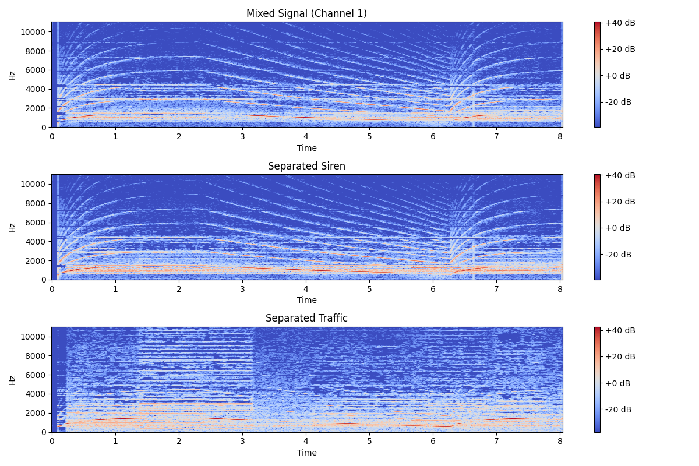

# Ear-Next BSS Emergency Sound Detection

This repository contains a Python-based prototype for Blind Source Separation (BSS) to detect emergency sounds, supporting the paper **"Ear-Next: Next-Generation Earphones Addressing Hearing Loss in the Digital Era"**. The project demonstrates how earphones can isolate emergency sounds (e.g., sirens) from background noise (e.g., traffic) using the `pyroomacoustics` library and the **Large-Scale Audio Dataset for Emergency Vehicle Sirens and Road Noises**.

## Project Overview

The script `detector_optimized_fixed.py` processes two audio files (`police_siren.wav` and `Mumbai_Traffic.wav`), applies BSS using the AuxIVA algorithm, and separates the mixed audio into siren and traffic components. It generates:

- **Separated audio files:**
  - `separated_siren.wav` – Isolated siren audio.
  - `separated_traffic.wav` – Isolated traffic noise.
- **Spectrogram plot:**
  - `bss_results.png` – Visualizes the mixed signal and separated sources.
- **Console output** indicating emergency sound detection.

This prototype provides empirical evidence for the paper’s claim that BSS can enable emergency sound detection in smart earphones.
